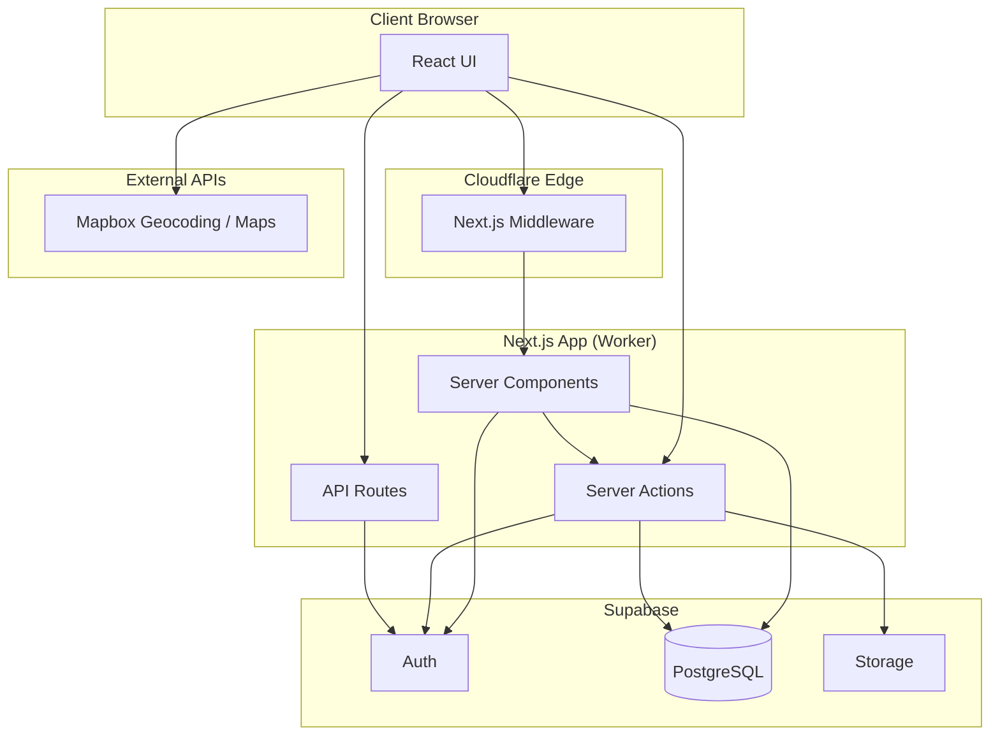
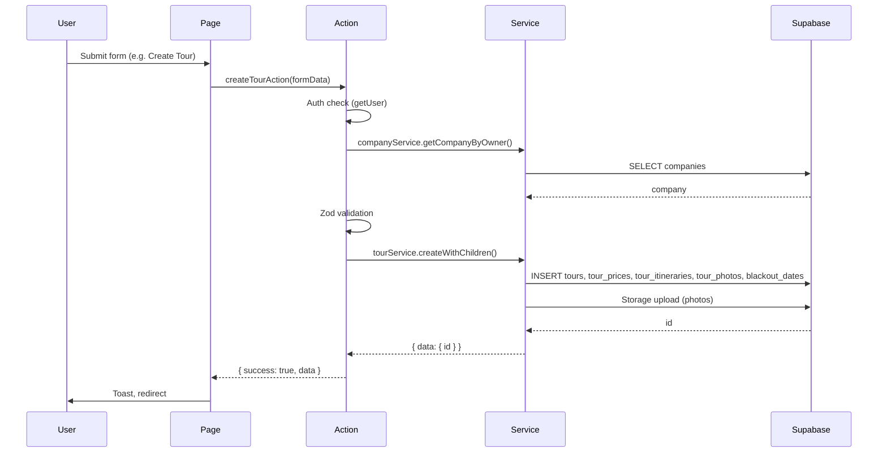
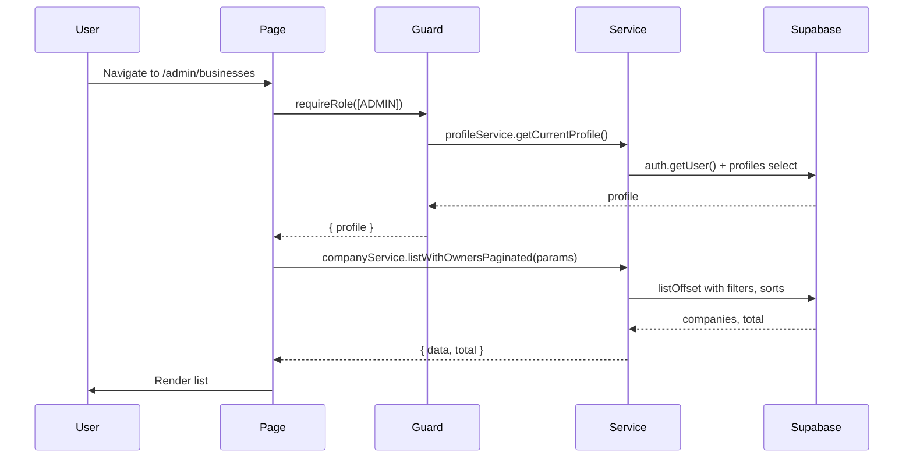
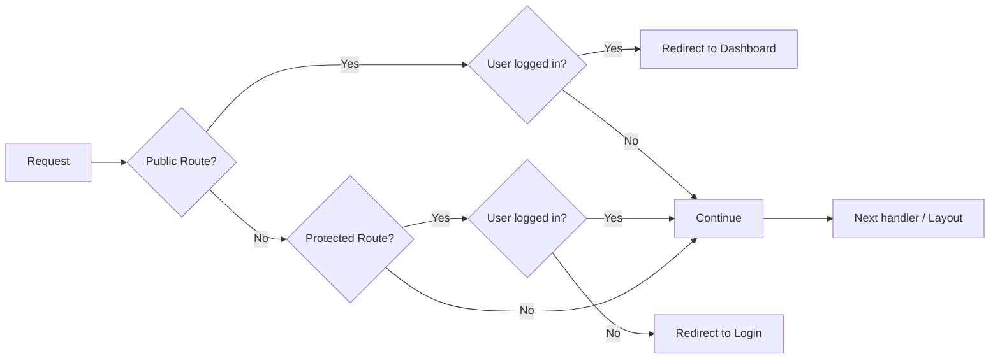

# Travel & Tour SaaS – Architecture Document

This document describes the technical architecture of the WorkWanders travel-and-tour platform, aligned with the current codebase.

---

## 1. System Overview

### 1.1 Core Purpose

WorkWanders is a **B2B2C SaaS platform** that connects travelers with tour operators. It enables:

- **Business owners** to register companies, submit permits, and create tour packages
- **Customers** to browse a marketing home page and an explore experience (listing UI is partly mock data; public tour search suggestions hit the database)
- **Admins** to approve businesses and moderate content

### 1.2 Primary Tech Stack

| Layer | Technology | Notes |
|-------|------------|-------|
| **Frontend** | Next.js 16 (App Router), React 19 | Server Components, Client Components, Server Actions |
| **Styling** | Tailwind CSS v4, shadcn-style UI | Primitives use the `radix-ui` package (e.g. `Slot`), CVA for variants |
| **Forms & validation** | react-hook-form, Zod 4 | Schemas at action/API boundaries |
| **Rich text** | TipTap | Used in tour/agency flows via shared editor component |
| **Backend** | Next.js API Routes + Server Actions | Single full-stack app |
| **Database** | PostgreSQL (Supabase) | Managed Postgres with RLS |
| **Auth** | Supabase Auth | Email/password, RLS, JWT sessions |
| **Storage** | Supabase Storage | Permits, tour photos |
| **Maps** | Mapbox, react-map-gl | Geocoding and location picking |
| **Deployment** | Cloudflare Workers | `@opennextjs/cloudflare`, Wrangler; `next.config.ts` calls `initOpenNextCloudflareForDev()` in dev |

### 1.3 High-Level Diagram



---

## 2. Folder Structure

### 2.1 Root Layout

```
travel-and-tour-saas-app/
├── src/
│   ├── app/                    # Next.js App Router (routes, layouts, API)
│   ├── components/
│   │   ├── ui/                 # shadcn-style primitives
│   │   ├── shared/             # Composable app UI: search/, explore/, marketing/, layout/, data-display/, forms/, maps/, footer/
│   │   └── features/           # Domain-specific UI that are reusable (e.g. tours/ agency wizard)
│   ├── config/                 # Routes, navigation by role, constants
│   ├── modules/                # Domain + shared server logic (see below)
│   ├── hooks/                  # Shared React hooks
│   ├── lib/                    # Pure utilities (cn, html plaintext, geo: countries, currencies, Mapbox helpers)
│   └── middleware.ts           # Auth + route protection (middleware.ts required for OpenNext Cloudflare)
├── supabase/
│   ├── config.toml             # Supabase project config (incl. schema_paths)
│   ├── migrations/             # Versioned SQL migrations
│   ├── schemas/                # Declarative DDL (source of truth for db diff)
│   ├── types/                  # Generated DB types (database.ts, index re-exports)
│   ├── utils/                  # createClient (browser/server/admin)
│   └── seeders/                # TS seed scripts (see package.json `seed`)
├── __tests__/                  # Jest unit tests
├── e2e/                        # Playwright E2E tests
├── docs/                       # architecture, plan, ERD, flow_guidebook/
└── .cursor/rules/              # Cursor / project conventions
```

**Naming:** Server-side domain code lives in **`src/modules/`** (imports: `@/modules/...`). Domain-specific **UI** stays under **`src/components/features/<domain>/`** (imports: `@/components/features/...`) so “modules” and on-disk “features” don’t refer to the same folder.

### 2.2 Directory Responsibilities

| Directory | Responsibility |
|-----------|----------------|
| **`src/app`** | Routes and layouts. Route groups: `(auth)`, `(dashboard)`, `(onboarding)`. Public marketing: `/`, `/explore`. API: e.g. `api/signup`. Thin route files: `page.tsx`, layouts, and small `client.tsx` entry points. See **§2.3** for colocation. |
| **`src/components/ui`** | Low-level primitives (Button, Dialog, Form, …). Editable first-class source. |
| **`src/components/shared`** | Cross-cutting compositions: `search/`, `explore/`, `marketing/`, `layout/` (shell, headers), `data-display/`, `forms/`, `maps/`, `footer/`. |
| **`src/components/features/<domain>`** | Feature-specific UI used by one domain (e.g. agency tour wizard steps, list table). Keeps `app/` free of large component trees and stable import paths (`@/components/features/...`). |
| **`src/config`** | `routes.ts` (path constants, `isPublicRoute` / `isProtectedRoute`), `navigation.ts` (sidebar by role). |
| **`src/modules/<domain>`** | Per-domain `*.service.ts`, `*.actions.ts`, `*.validation.ts`, `*.types.ts`, optional `utils/`. |
| **`src/modules/shared`** | Cross-domain server helpers: `supabase-service.ts` (CRUD factory), `storage-service.ts`, `list-params.ts`, `types.ts` (`ActionResult`). |
| **`src/hooks`** | e.g. `useDebouncedCallback`, `useDefaultMapCenter`. |
| **`src/lib`** | `utils.ts` (`cn`), `html.ts` (strip HTML → plaintext for validation), `geo/*` (countries, currencies, Mapbox geocoding helpers). |
| **`supabase/migrations`** | Applied via `supabase db push`; generated from schema diff per team workflow. |
| **`supabase/schemas`** | Table DDL: profiles, companies, tours (+ prices, itineraries, photos, categories, blackouts), bookings, reviews, categories, RLS in `rls.sql`. |
| **`supabase/utils`** | Supabase clients for server, browser, and service role. |

### 2.3 Route colocation and domain UI (`components/features/`)

- **Route-local components** live in `components/` next to the route segment they belong to (e.g. `app/(dashboard)/profile/components/`). Do **not** use `_components` for new work; prefer plain `components/` for consistency and simpler paths.
- **Lift to `src/components/features/<domain>/`** when UI is specific to one domain but large, reused across multiple routes under that domain, or when imports would otherwise anchor to long `app/(…)/` paths. Example: agency tour wizard steps and `ToursTable` live under `components/features/tours/`.
- **Public tour detail URLs** (when implemented) should use a **single** dynamic segment. Prefer **`slug`** for SEO and stable links; avoid parallel `[id]` and `[slug]` trees for the same page.

---

## 3. Core Patterns

### 3.1 Module pattern (server)

Domain folders (`profile`, `company`, `tours`) under `src/modules/` typically include:

```
modules/<domain>/
├── <domain>.service.ts      # Data access, Supabase queries
├── <domain>.actions.ts      # Authenticated Server Actions ("use server")
├── <domain>.validation.ts   # Zod schemas
├── <domain>.types.ts        # TypeScript types
├── <domain>.constants.ts    # Buckets, limits (optional)
├── <domain>.guard.ts        # Role helpers (profile)
├── <domain>.public-actions.ts  # Optional: public Server Actions (no session required)
└── utils/                   # List configs, wizard helpers, explore URL parsing
```

- **Services** perform CRUD and workflows via Supabase; consumed by actions and RSC.
- **Actions** validate input, call services, return **`ActionResult`** for mutations.
- **`*.public-actions.ts`** holds actions safe for anonymous use (e.g. typeahead search), with Zod bounds.

**Shared module layer** (`modules/shared/`):

- **`supabaseService(tableName)`** – typed CRUD: `create`, `getById`, `update`, `listOffset`, etc.
- **`list-params.ts`** – `ListConfig`, `ListParams`, `parseListParams`, `toQueryParams` for filter/sort/search URLs.
- **`types.ts`** – `ActionResult<T>` for server actions and API responses.
- **`storage-service.ts`** – upload helpers used when creating/updating tours and permits.

Services often return **`ServiceResult<T>`** or **`OffsetResult<Row>`** (`data` / `error` shape) from `supabase-service.ts`, while actions map those to **`ActionResult`** for the UI.

### 3.2 Data Access: Service Factory

```typescript
// Typed CRUD wrapper for a table
const base = supabaseService("companies")
// base.create(), base.getById(), base.update(), base.listOffset(), …
```

Domain services extend this with joins, storage, and role-scoped queries (e.g. `companyService.getCompanyByOwner`, `tourService.listForAgencyPage`).

### 3.3 List Params Pattern

Defined in **`src/modules/shared/list-params.ts`**. Each domain module supplies a **`ListConfig`** (filters, sorts, search columns, page size) in its `utils/*-list-config.ts` (e.g. `agency-tours-config.ts`, `businesses-list-config.ts`).

- **`parseListParams()`** – URL `searchParams` → `ListParams`
- **`toQueryParams()`** – `ListParams` → Supabase filters / sorts / `or` clause
- Used by admin business list and agency tour list.

### 3.4 Explore / Public Search Params

Tour discovery uses **`src/modules/tours/utils/explore-search-params.ts`** and **`explore-search.constants.ts`** for URL keys (`q`, `place`, `bbox`, `tour`, etc.) and unified destination vs tour vs keyword selection. **`tourService.searchPublicTourSuggestions`** queries active tours; **`searchPublicTourSuggestionsAction`** in **`tour.public-actions.ts`** exposes it to the client with Zod limits.

### 3.5 ActionResult Contract

Defined in **`src/modules/shared/types.ts`**:

```typescript
type ActionResult<T = undefined> = {
  success: boolean
  message?: string
  fieldErrors?: Record<string, string[]>
  data?: T
}
```

### 3.6 Role Guard Pattern

`requireRole(allowedRoles)` (profile feature) in Server Components / layouts:

1. Resolves current profile via `profileService.getCurrentProfile()`.
2. If no profile → redirect to login.
3. If role not allowed → redirect to role home (`getNavConfig(role).home`).
4. Returns `{ profile }` for downstream use.

### 3.7 Supabase Client Strategy

| Client | Location | Use Case |
|--------|----------|----------|
| **Server** | `supabase/utils/server.ts` | RSC, Server Actions, API routes (cookies) |
| **Admin** | `supabase/utils/admin.ts` | Service-role operations |
| **Browser** | `supabase/utils/client.ts` | Client Components when needed |

**Middleware** uses `@supabase/ssr` `createServerClient` with cookie get/set on `NextResponse` (session refresh + route gating).

### 3.8 Middleware & Routes

- **`src/config/routes.ts`** – Single source of truth for paths; **`PUBLIC_ROUTES`** vs **`AUTHED_ROUTES`** drive middleware.
- Logged-in users hitting a **public** route (e.g. `/`, `/explore`) are redirected to **`/dashboard`**.
- Paths not in either set bypass the public/protected redirect logic.

---

## 4. Data Flow

### 4.1 Request Flow (Typical Mutations)



### 4.2 Request Flow (Reads via Server Components)



### 4.3 Middleware Flow



---

## 5. Key Modules

### 5.1 User Management & Auth

| Component | Responsibility |
|-----------|----------------|
| `profile.service` | Sign up (Auth + profile), get current profile, update profile |
| `profile.actions` | Login, logout, forgot/reset password, profile update |
| `profile.guard` | `requireRole()` |
| `profile.validation` | Zod for login, signup, profile |
| **API** | `POST /api/signup` → `profileService` |

### 5.2 Company / Business Onboarding

| Component | Responsibility |
|-----------|----------------|
| `company.service` | CRUD, `getCompanyByOwner`, `listWithOwnersPaginated`, `getStatusCounts` (RPC), permit upload, signed URL |
| `company.actions` | `createCompanyAction` (FormData + permit), `updateCompanyAction`, **`updateCompanyStatusAction`** (admin; redirects to list) |
| `BusinessOnboardingModal` | New business flow |
| **Storage** | `company-permits` bucket |

### 5.3 Tour & Product Management

| Component | Responsibility |
|-----------|----------------|
| `tour.service` | `listForAgencyPage` (role-scoped), `createWithChildren`, **`updateWithChildren`**, **`toggleActive`**, **`searchPublicTourSuggestions`** |
| `tour.actions` | `createTourAction`, **`updateTourAction`**, **`toggleTourActiveAction`** |
| `tour.public-actions` | `searchPublicTourSuggestionsAction` (public typeahead) |
| **`CreateTourWizardClient`** | Multi-step create wizard (`agency/tours/new/client.tsx` → step UI in `components/features/tours/`); edit reuse under `agency/tours/[id]/edit/` |
| **Storage** | Tour photos bucket |
| **Related tables** | tours, tour_prices, tour_itineraries, tour_photos, blackout_dates, tour_categories, categories |

### 5.4 Public Discovery (Explore)

| Area | Responsibility |
|------|----------------|
| **`/explore`** | Client page: filters, sort, pagination UI; results may use mock package data until wired to a public list API |
| **Shared components** | `explore-search-bar`, `unified-tour-explore-search`, `explore-packages-grid`, `explore-filters-sidebar`, etc. |
| **Server** | Public suggestions via `tour.public-actions` + `tourService.searchPublicTourSuggestions` |

### 5.5 Admin Business Management

| Component | Responsibility |
|-----------|----------------|
| `admin/businesses/page` | List, filters, status counts, pagination |
| `admin/businesses/[id]/page` | Detail, status changes via forms |
| `companyService.getStatusCounts` | RPC `get_company_status_counts` |

### 5.6 Schema Footprint (Evolution)

Tables for **bookings** and **reviews** exist in `supabase/schemas/` for upcoming traveler flows; product code may not expose them yet.

---

## 6. External Integrations

| Service | Purpose | Env Variable |
|---------|---------|--------------|
| **Supabase** | Auth, PostgreSQL, Storage | `NEXT_PUBLIC_SUPABASE_URL`, `NEXT_PUBLIC_SUPABASE_ANON_KEY`, `SUPABASE_SERVICE_ROLE_KEY` |
| **Mapbox** | Geocoding, maps | `NEXT_PUBLIC_MAPBOX_ACCESS_TOKEN` |
| **Unsplash / demo hosts** | Marketing placeholders | Configured in `next.config.ts` `images.remotePatterns` |

### 6.1 Mapbox Usage

- **Geocoding**: place search (`mapbox.places`), reverse geocode.
- **Map display**: `react-map-gl` + `mapbox-gl` in location picker; heavy map client often loaded with `dynamic(..., { ssr: false })` where used.

### 6.2 Supabase Storage Buckets

- **company-permits** – permit documents.
- **tour-photos** – tour images.

---

## 7. Deployment & Environment

- **Platform**: Cloudflare Workers via OpenNext adapter; scripts in `package.json`: `build:cloudflare`, `deploy`, `preview`, etc.
- **Build**: `next build` with `output: "standalone"`; local Supabase storage images may use `dangerouslyAllowLocalIP` in development only.
- **Environment**: `NEXT_PUBLIC_APP_URL` where used for redirects; Supabase and Mapbox as above.

---

## 8. Conventions & References

- **Import alias**: `@/` → `src/`; `@supabase/*` → `supabase/*` (e.g. `@supabase/types/database` for generated `Database` type).
- **ERD**: `docs/erd.md`; DDL: `supabase/schemas/`.
- **Plan / phases**: `docs/plan.md`.
- **Narrative flows**: `docs/flow_guidebook/` (e.g. tour creation).
