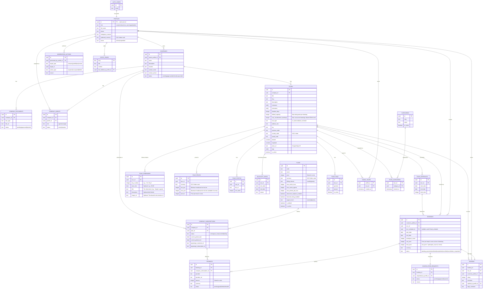

# Entity Relationship Diagram

```mermaid
  erDiagram
    AUTH_USERS {
      uuid id PK
      text email
    }
    PROFILES {
      uuid id PK "FK → auth.users.id"
      text role "customer|business_owner|agent|admin"
      text full_name
      text phone
      text emergency_contact
      text preferred_currency "ISO 3-letter code"
      text status "active|suspended"
    }
    COMPANIES {
      uuid id PK
      uuid owner_profile_id FK
      text name
      text description
      text location
      text contact_email
      text contact_phone
      text status "pending|approved|declined|suspended"
    }
    COMPANY_DOCUMENTS {
      uuid id PK
      uuid company_id FK
      text doc_type
      text file_url
      text status "pending|approved|rejected"
    }
    COMPANY_AGENTS {
      uuid id PK
      uuid company_id FK
      uuid profile_id FK
      text role "agent|manager"
      text status "active|inactive"
    }
    PLANS {
      uuid id PK
      text code
      text name
      integer price "Stored in cents"
      text currency "ISO 3-letter code"
      text billing_interval "monthly|yearly"
      integer max_active_tours
      integer max_active_agents
      integer max_photos_per_tour
      boolean advanced_analytics_enabled
      boolean featured_listing_enabled
      text support_level "standard|priority"
      boolean is_default
      boolean is_active
    }
    COMPANY_SUBSCRIPTIONS {
      uuid id PK
      uuid company_id FK
      uuid plan_id FK
      text status "active|past_due|canceled|trialing"
      date current_period_start
      date current_period_end
      text paymongo_customer_id
      text paymongo_subscription_id
    }
    TOURS {
      uuid id PK
      uuid company_id FK
      text title
      text slug
      text description
      text[] inclusions
      text[] exclusions
      integer duration_days
      integer default_capacity "Max total guests per booking"
      integer max_simultaneous_bookings "Max concurrent bookings allowed (Fleet size)"
      text tour_type "on_demand|fixed_schedule"
      text address_line
      text city
      text province_state
      text country_code "ISO 2-letter"
      text postal_code
      numeric latitude
      numeric longitude
      text place_id "Google Maps ID"
      text[] tags
      boolean is_active
    }
    TOUR_ITINERARIES {
      uuid id PK
      uuid tour_id FK
      integer day_number "e.g., 1 for Day 1"
      time start_time "Optional: e.g., 08:00"
      text title "The destination (e.g., Tangke Lagoon)"
      text description "Optional brief details"
      text image_url "Optional: Thumbnail for the timeline UI"
    }
    TOUR_PRICES {
      uuid id PK
      uuid tour_id FK
      text currency "ISO 3-letter code"
      integer min_pax "Minimum headcount for this tier"
      integer max_pax "Maximum headcount for this tier (nullable if no max)"
      integer amount "Price per head in cents"
    }
    TOUR_PHOTOS {
      uuid id PK
      uuid tour_id FK
      text file_url
      integer sort_order
    }
    BLACKOUT_DATES {
      uuid id PK
      uuid tour_id FK
      date start_date
      date end_date
      text reason
    }
    TOUR_SCHEDULES {
      uuid id PK
      uuid tour_id FK
      date start_date
      date end_date
      integer total_slots
    }
    TOUR_FAQS {
      uuid id PK
      uuid tour_id FK
      text question
      text answer
      boolean is_active
    }
    SAVED_TOURS {
      uuid profile_id FK
      uuid tour_id FK
      timestamp created_at
    }
    CATEGORIES {
      uuid id PK
      text slug
      text name
      boolean is_active
    }
    TOUR_CATEGORIES {
      uuid tour_id FK
      uuid category_id FK
      timestamp created_at
    }
    BOOKINGS {
      uuid id PK
      uuid customer_profile_id FK
      uuid tour_id FK
      uuid tour_schedule_id FK "nullable, used if fixed_schedule"
      date start_date
      date end_date
      integer participant_count
      integer unit_price "Price per head in cents at time of booking"
      integer total_price "unit_price * participant_count (in cents)"
      text currency
      text status "pending_payment|confirmed|completed|cancelled|cancellation_requested"
    }
    PAYMENTS {
      uuid id PK
      uuid booking_id FK
      uuid company_subscription_id FK
      text provider
      text provider_ref
      integer amount "Stored in cents"
      text currency
      text status "pending|paid|failed|refunded"
    }
    CANCELLATION_REQUESTS {
      uuid id PK
      uuid booking_id FK
      uuid requested_by_profile_id FK
      text status "pending|approved|rejected"
      text reason
    }
    REVIEWS {
      uuid id PK
      uuid booking_id FK
      uuid tour_id FK
      uuid customer_profile_id FK
      integer rating
      text comment
      uuid replied_by_profile_id FK
      text reply_comment
    }
    MODERATION_ACTIONS {
      uuid id PK
      uuid performed_by_profile_id FK
      text target_type "company|profile|tour|review"
      uuid target_id
      text action_type "suspend|unsuspend|delete"
      text reason
    }
    STATIC_PAGES {
      text slug PK
      text title
      text content
      uuid last_edited_by_profile_id FK
    }

    AUTH_USERS ||--|| PROFILES : "has profile"
    PROFILES ||--o{ COMPANIES : "owns"
    COMPANIES ||--o{ COMPANY_DOCUMENTS : "has"
    COMPANIES ||--o{ COMPANY_AGENTS : "has"
    PROFILES ||--o{ COMPANY_AGENTS : "assigned as"
    PLANS ||--o{ COMPANY_SUBSCRIPTIONS : "defines"
    COMPANIES ||--o{ COMPANY_SUBSCRIPTIONS : "subscribes to"
    COMPANIES ||--o{ TOURS : "lists"
    TOURS ||--o{ TOUR_ITINERARIES : "follows timeline"
    TOURS ||--o{ TOUR_PRICES : "priced in"
    TOURS ||--o{ TOUR_PHOTOS : "has"
    TOURS ||--o{ BLACKOUT_DATES : "has blackout dates"
    TOURS ||--o{ TOUR_SCHEDULES : "schedules"
    TOURS ||--o{ TOUR_FAQS : "has"
    PROFILES ||--o{ SAVED_TOURS : "saves"
    TOURS ||--o{ SAVED_TOURS : "saved in"
    CATEGORIES ||--o{ TOUR_CATEGORIES : "categorizes"
    TOURS ||--o{ TOUR_CATEGORIES : "classified as"
    PROFILES ||--o{ BOOKINGS : "creates"
    TOURS ||--o{ BOOKINGS : "booked as"
    TOUR_SCHEDULES ||--o{ BOOKINGS : "booked for"
    BOOKINGS ||--o{ PAYMENTS : "paid by"
    COMPANY_SUBSCRIPTIONS ||--o{ PAYMENTS : "billed via"
    BOOKINGS ||--|| CANCELLATION_REQUESTS : "may have"
    BOOKINGS ||--|| REVIEWS : "may have"
    PROFILES ||--o{ REVIEWS : "writes"
    TOURS ||--o{ REVIEWS : "receives"
    PROFILES ||--o{ MODERATION_ACTIONS : "performs"
    PROFILES ||--o{ STATIC_PAGES : "edits"
```
