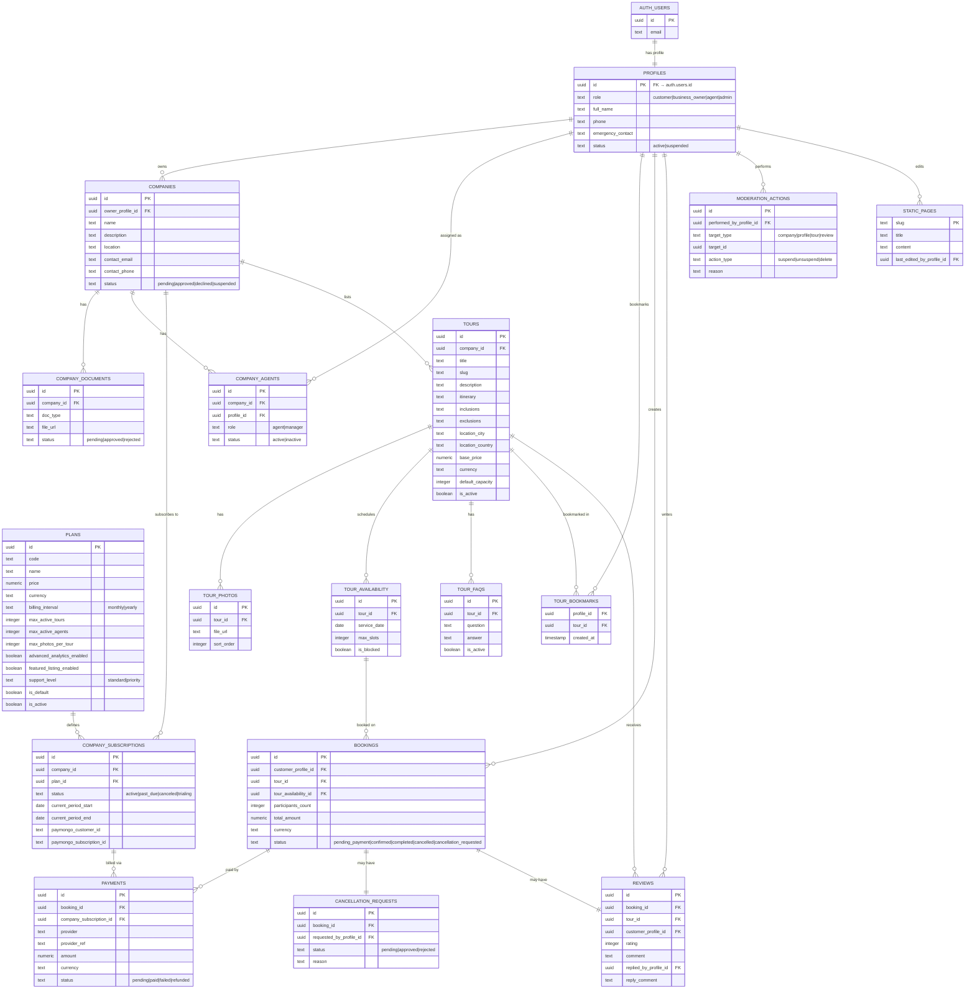

# Entity Relationship Diagram

```mermaid
erDiagram
  AUTH_USERS {
    uuid id PK
    text email
  }
  PROFILES {
    uuid id PK "FK → auth.users.id"
    text role "customer|business_owner|agent|admin"
    text full_name
    text phone
    text emergency_contact
    text status "active|suspended"
  }
  COMPANIES {
    uuid id PK
    uuid owner_profile_id FK
    text name
    text description
    text location
    text contact_email
    text contact_phone
    text status "pending|approved|declined|suspended"
  }
  COMPANY_DOCUMENTS {
    uuid id PK
    uuid company_id FK
    text doc_type
    text file_url
    text status "pending|approved|rejected"
  }
  COMPANY_AGENTS {
    uuid id PK
    uuid company_id FK
    uuid profile_id FK
    text role "agent|manager"
    text status "active|inactive"
  }
  PLANS {
    uuid id PK
    text code
    text name
    numeric price
    text currency
    text billing_interval "monthly|yearly"
    integer max_active_tours
    integer max_active_agents
    integer max_photos_per_tour
    boolean advanced_analytics_enabled
    boolean featured_listing_enabled
    text support_level "standard|priority"
    boolean is_default
    boolean is_active
  }
  COMPANY_SUBSCRIPTIONS {
    uuid id PK
    uuid company_id FK
    uuid plan_id FK
    text status "active|past_due|canceled|trialing"
    date current_period_start
    date current_period_end
    text paymongo_customer_id
    text paymongo_subscription_id
  }
  TOURS {
    uuid id PK
    uuid company_id FK
    text title
    text slug
    text description
    text itinerary
    text inclusions
    text exclusions
    text location_city
    text location_country
    numeric base_price
    text currency
    integer default_capacity
    boolean is_active
  }
  TOUR_PHOTOS {
    uuid id PK
    uuid tour_id FK
    text file_url
    integer sort_order
  }
  TOUR_AVAILABILITY {
    uuid id PK
    uuid tour_id FK
    date service_date
    integer max_slots
    boolean is_blocked
  }
  TOUR_FAQS {
    uuid id PK
    uuid tour_id FK
    text question
    text answer
    boolean is_active
  }
  TOUR_BOOKMARKS {
    uuid profile_id FK
    uuid tour_id FK
    timestamp created_at
  }
  BOOKINGS {
    uuid id PK
    uuid customer_profile_id FK
    uuid tour_id FK
    uuid tour_availability_id FK
    integer participants_count
    numeric total_amount
    text currency
    text status "pending_payment|confirmed|completed|cancelled|cancellation_requested"
  }
  PAYMENTS {
    uuid id PK
    uuid booking_id FK
    uuid company_subscription_id FK
    text provider
    text provider_ref
    numeric amount
    text currency
    text status "pending|paid|failed|refunded"
  }
  CANCELLATION_REQUESTS {
    uuid id PK
    uuid booking_id FK
    uuid requested_by_profile_id FK
    text status "pending|approved|rejected"
    text reason
  }
  REVIEWS {
    uuid id PK
    uuid booking_id FK
    uuid tour_id FK
    uuid customer_profile_id FK
    integer rating
    text comment
    uuid replied_by_profile_id FK
    text reply_comment
  }
  MODERATION_ACTIONS {
    uuid id PK
    uuid performed_by_profile_id FK
    text target_type "company|profile|tour|review"
    uuid target_id
    text action_type "suspend|unsuspend|delete"
    text reason
  }
  STATIC_PAGES {
    text slug PK
    text title
    text content
    uuid last_edited_by_profile_id FK
  }

  AUTH_USERS ||--|| PROFILES : "has profile"
  PROFILES ||--o{ COMPANIES : "owns"
  COMPANIES ||--o{ COMPANY_DOCUMENTS : "has"
  COMPANIES ||--o{ COMPANY_AGENTS : "has"
  PROFILES ||--o{ COMPANY_AGENTS : "assigned as"
  PLANS ||--o{ COMPANY_SUBSCRIPTIONS : "defines"
  COMPANIES ||--o{ COMPANY_SUBSCRIPTIONS : "subscribes to"
  COMPANIES ||--o{ TOURS : "lists"
  TOURS ||--o{ TOUR_PHOTOS : "has"
  TOURS ||--o{ TOUR_AVAILABILITY : "schedules"
  TOURS ||--o{ TOUR_FAQS : "has"
  PROFILES ||--o{ TOUR_BOOKMARKS : "bookmarks"
  TOURS ||--o{ TOUR_BOOKMARKS : "bookmarked in"
  PROFILES ||--o{ BOOKINGS : "creates"
  TOUR_AVAILABILITY ||--o{ BOOKINGS : "booked on"
  BOOKINGS ||--o{ PAYMENTS : "paid by"
  COMPANY_SUBSCRIPTIONS ||--o{ PAYMENTS : "billed via"
  BOOKINGS ||--|| CANCELLATION_REQUESTS : "may have"
  BOOKINGS ||--|| REVIEWS : "may have"
  PROFILES ||--o{ REVIEWS : "writes"
  TOURS ||--o{ REVIEWS : "receives"
  PROFILES ||--o{ MODERATION_ACTIONS : "performs"
  PROFILES ||--o{ STATIC_PAGES : "edits"
```
